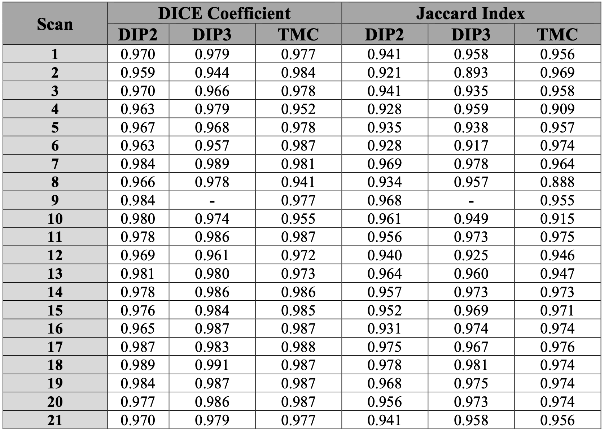
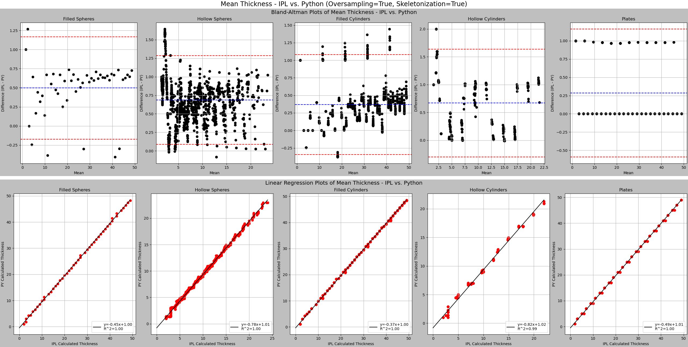
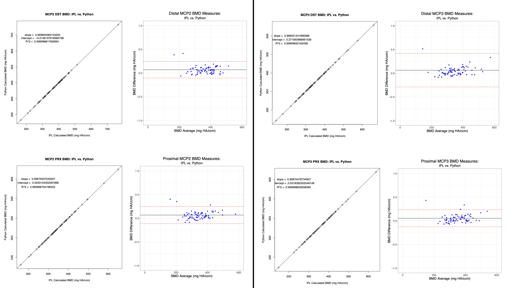
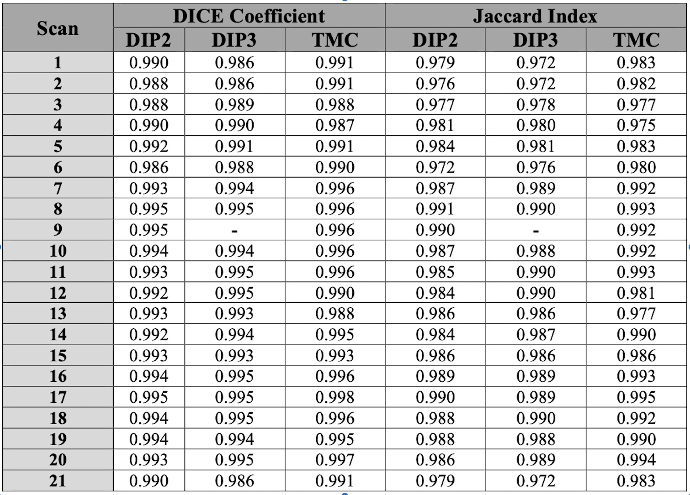

1 – Statement of Need:

High resolution peripheral quantitative computed tomography (HR-pQCT) is an imaging technique that is used to assess bone microarchitecture and density with a nominal isotropic voxel size of 61um.  HR-pQCT has a wide range of applications, including improving our understanding of bone diseases [1](https://doi.org/10.1186/s12880-020-00437-8), assessment of age-related changes [2](https://doi.org/10.1002/jbmr.2873), and evaluating the effects of pharmaceutical interventions [3](https://doi.org/10.1080/03009742.2020.1869303). Processing HR-pQCT images has largely been limited to the scanner manufacturer’s scripting language (Image Processing Language, IPL, Scanco Medical). By expanding image processing workflows outside of the scanner manufacturer’s environment, users can apply more advanced mathematical techniques to improve image processing. The ORMIR_XCT Python package was developed to first reimplement some existing IPL workflows and to provide an open and reproducible package to allow for the development of more advanced image processing workflows for HR-pQCT data.

The development of this package began during the Jupyter Community Workshop in Maastricht, Netherlands in June 2022, hosted by the Open and Reproducible Musculoskeletal Imaging Research (ORMIR) group. During this workshop, the conceptualization and initial development of the ORMIR_XCT package began with support from Kitware.

2 – Package Summary:

Image processing of HR-pQCT scans has largely been limited to the use of the scanner manufacturer's processing language (Image Processing Language, IPL, Scanco Medical). To expand on existing IPL workflows developed for HR-pQCT data, the ORMIR_XCT package was created. This package reimplements existing IPL scripts and workflows in Python and adds additional functionality to improve current image processing techniques applied to HR-pQCT data.

The ORMIR_XCT package contains several modules for processing HR-pQCT data of bones and joints, including joint space analysis, bone mineral density calculations, automatic contouring of the periosteal surface, and segmentation of trabecular bone. Analyses have been performed to compare results generated using the ORMIR_XCT package to results generated using IPL. Jupyter Notebook examples are provided to describe some of the workflows implemented in ORMIR_XCT package.

3 – Workflows:

The ORMIR_XCT package contains four IPL workflows reimplemented in Python:
1.	Automatic Periosteal Contouring
2.	Joint Space Width Analysis
3.	Bone Mineral Density
4.	Trabecular Bone Segmentation

4 – Comparison to IPL: 

Autocontour:
Automatic periosteal contouring (autocontour) was performed on a sample dataset of HR-pQCT images of the 2nd and 3rd distal interphalangeal (DIP) and trapeziometacarpal (TMC) joints (n = 62). Binarized images were obtained using the IPL standard method for automatic periosteal contouring and using the ORMIR_XCT package. Segmentations were compared by computing the DICE coefficient and Jaccard index between images. The IPL method for automatic periosteal contouring was assumed to be the ground truth. Results of the segmentation comparison are shown in \autoref{fig:autocontour}.

Thickness:
The ORMIR_XCT package contains an open-source implementation of Hildebrand et al.'s algorithm for model-independent thickness estimation [4](https://doi.org/10.1046/j.1365-2818.1997.1340694.x). Given a binary mask describing a three-dimensional object as input, the algorithm first computes the distance map (via a distance transform), describing at each voxel the radius of the largest sphere centered at that voxel that is entirely within the object. Next, the local thickness map is computed by iterating through all voxels in the mask and  assigning them a local thickness value that is the diameter of the largest sphere in the distance map that contains that voxel. The thickness of a structure can then be computed as the volume-weighted mean of the local thickness map, with optional adjustments for a minimum thickness value if desired to reduce the effect of surface noise.

Hildebrand et al. note an optimization for the algorithm where first the distance ridge (also known as skeletonization or medial axis) is computed and only the distance map values on the distance ridge are used for local thickness map computation. We have implemented this optimized version of the algorithm with the NumPy and Numba Python packages. Finally, we have noted, and compensated for, a discrepancy between Hildebrand et al.'s definition of the distance map and the outputs of many common open-source distance map algorithms (including those available in SimpleITK and scikit-image). Hildebrand et al. define their distance map as "the radius of the largest sphere centered at the point and still completely inside the structure." In contrast, most distance transforms will compute the distance from the center of a voxel inside the mask to the nearest voxel center outside the mask. The discrepancy is visualized in Figure 2 \autoref{fig: oversampling}.

To compensate for this, we have developed an oversampling distance transform function. In this function, an input mask is upsampled to double the resolution, and a sequence of morphological filters are applied to ensure that the newly introduced voxels on the boundary between the structure and the background are assigned to be background voxels. A distance transform is applied to this mask, resulting in a distance map where the spheres fit entirely within the structure defined by the mask, and the resulting distance map is downsampled back to the original resolution.

The user is given a choice, via a boolean flag parameter in the compute_local_thickness_from_mask and calc_structure_thickness_statistics functions, whether they would like to use the oversampling distance transform for thickness estimation. The choice is given because different users may have differing definitions of the bounds of their structures (whether they are contained within the mask voxels or may extend to the center of the neighbouring background voxels) and because using the normal distance transform will provide better congruence with thickness calculations produced using IPL.

To evaluate the thickness computation implemented in the ORMIR_XCT package, a set of synthetic shapes were generated. These shapes include solid spheres, hollow spheres, filled cylinders, hollow cylinders, and plates of varying thicknesses [5](https://doi.org/10.5281/zenodo.8155738). The standard IPL joint space width (JSW) analysis workflow [6](http://dx.doi.org/10.21037/qims.2019.12.11) was performed on the synthetic shape dataset using the following parameters: ridge_epsilon = 0.9, assign_epsilon = 1.8, suppress_boundary = 0, and version = 3. This set of parameters is currently used for JSW analysis of in vivo finger joints. ORMIR_XCT thickness was calculated using the oversampling distance transform function described above. Bland-Altman plots were generated to compare thickness results between algorithms and are shown in Figure 3 \autoref{fig:thickness}.

Bone Mineral Density:
Images obtained from HR-pQCT scanners are saved using the manufacturer’s proprietary file format (.AIM). To process HR-pQCT images using Python, these files need to be converted to a file format that be interpreted by common image processing Python libraries (e.g., SimpleITK). The ITKIOScanco module is used in the ORMIR_XCT package to convert HR-pQCT images to other common medical image file types. However, the ITKIOScanco module converts HR-pQCT images to Hounsfield Units (HU) by default. Measures of bone mineral density (BMD) require the image units to be density units (mg of Hydroxyapatite per cm3). Several image unit conversions have been included in the ORMIR_XCT package to allow for conversion between HR-pQCT native units (termed Scanco units), HU, density units, and linear attenuation units.

A sample dataset of HR-pQCT images of second and third metacarpal phalangeal (MCP) joints (n = 292) was used to compare BMD results between IPL and the ORMIR_XCT package. BMD is reported for the distal (DST) and proximal (PRX) segments of each joint. Results of this comparison are shown in Figure 4 \autoref{fig:bmd}.

	
Trabecular Segmentation:
A common operation performed in IPL is the application of a Gaussian smoothing filter followed by a threshold-based image segmentation. The gauss_seg function in IPL has been reimplemented in the ORMIR_XCT package and the similarity of IPL and ORMIR_XCT trabecular segmentations were computed using DICE coefficients and Jaccard indices \autoref{fig:trab_seg}.

